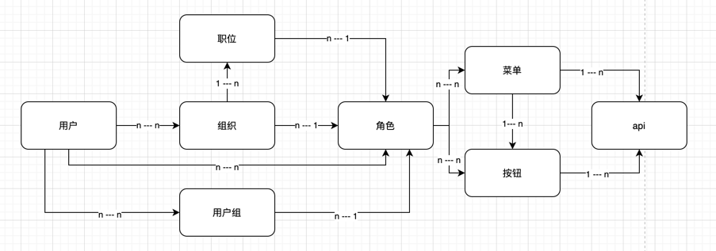

## basic-frame介绍
basic-frame是一款基于Go语言的项目基础框架。项目包含：

  + **日志信息收集：** 使用logrus对日志进行保存和分割，日志分割和最大保存时间在`config.ini`文件的`Logger`中设置。默认按天拆分日志文件，日志最多保存30天
 
  + **Mysql自动建表：** 使用gorm2.0对数据库进行操作。自动创建表结构
    
  + **Casbin访问控制：** 根据用户绑定的角色、角色可以访问的页面/按钮、页面/按钮绑定的API，来生成用户与角色的关系、角色与API的关系。最终决定当前用户是否可以访问某个API

  + **菜单配置文件：** `menu.json`文件用于热更新系统的菜单信息。也可以通过访问API接口更新菜单信息

  + **在线API文档：** 基于swagger一键生成在线API文档
    + #### 使用swagger文档所需安装的依赖
      ```shell
      go install github.com/swaggo/swag/cmd/swag@latest
      go get -u -v github.com/swaggo/gin-swagger
      go get -u -v github.com/swaggo/files
      ```

    + #### 生成/更新 swagger 文档
      ```shell
      make swagger
      ```

  + **i18n国际化：** 扫描项目，将所有需要国际化的信息放入`util/i18n/translations/locales`目录中，默认使用中文，可选中文、英文。如有更多语言需要，在`util/i18nLocalizer/Localizer.go`中新增即可。
    + #### 使用i18n所需安装的依赖
      ```shell
      go install golang.org/x/text/cmd/gotext@latest
      ```

  + **用户权限：** 基于RBAC3.0规范设置的权限系统。



## 启动程序
```shell
make start
```

## 生成linux可执行文件
```shell
make linux-build
```

## 生成windows可执行文件
```shell
make windows-build
```

## 生成linux可执行程序(windows操作系统使用)
```shell
SET CGO_ENABLED=0
SET GOOS=darwin
SET GOARCH=amd64
go build basic-frame
```